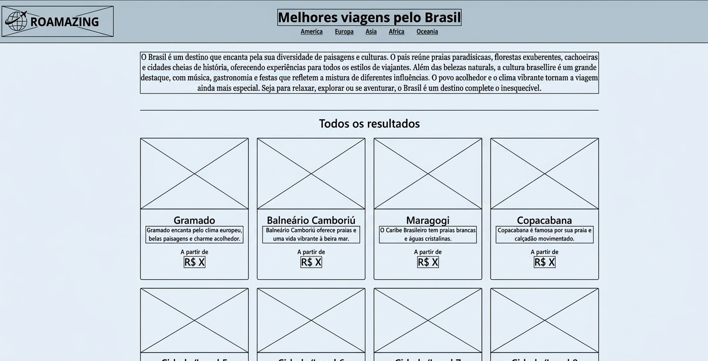
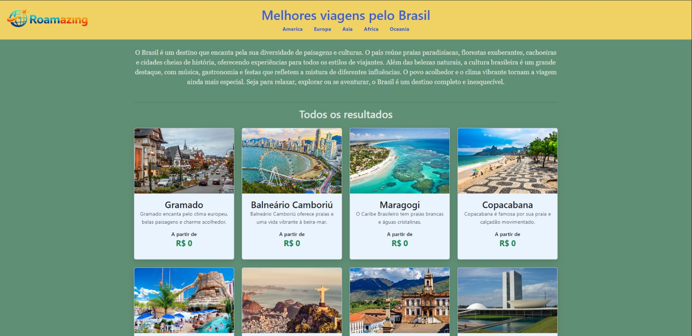
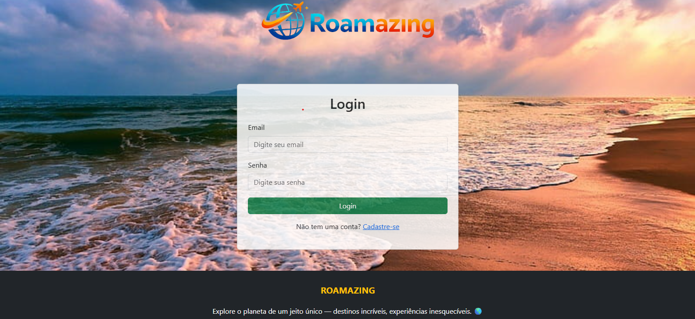

Nome: Rafael Ferreira Torres Modesto
Matricula: 917616

Proposta Escolhida: Desenvolvimento de uma plataforma de curadoria de viagens focada em destinos brasileiros e internacionais.

Breve Descrição: Catálogo digital de destinos utilizado para apresentar pacotes e locais turísticos. O foco é oferecer uma descrição direta, com informações de preços e descrições rápidas que facilitam a escolha do viajante.

Estrutura do projeto: Utiliza o padrão de projeto MVC (Model, View, Controller)
Views: Responsáveis pela parte visual do projeto
Model: Parte responsável por armazenar dados (do BD)
Controller: Possui a lógica de negócios e realiza a comunicação entre view e model